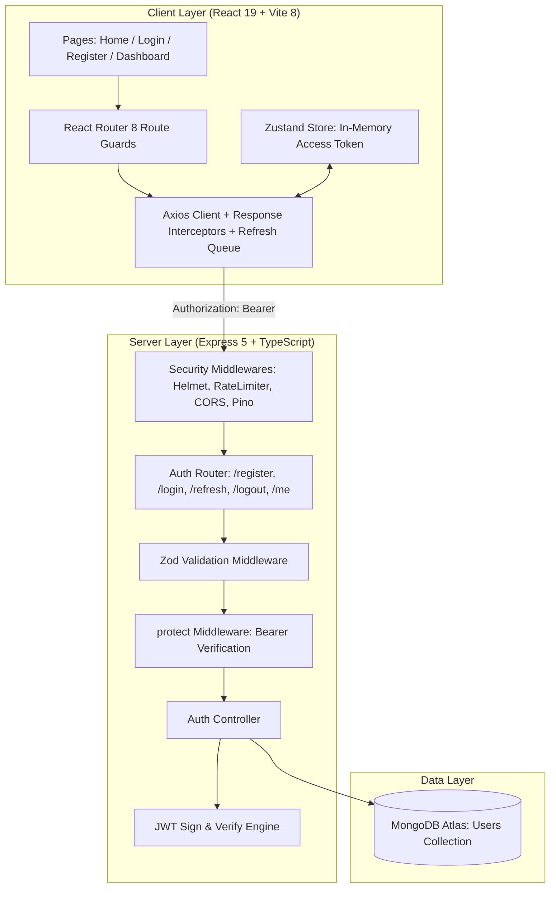
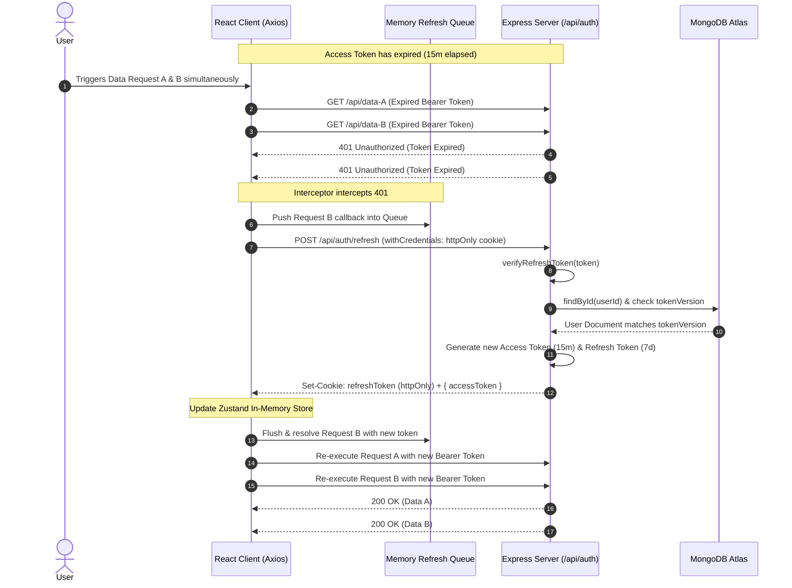
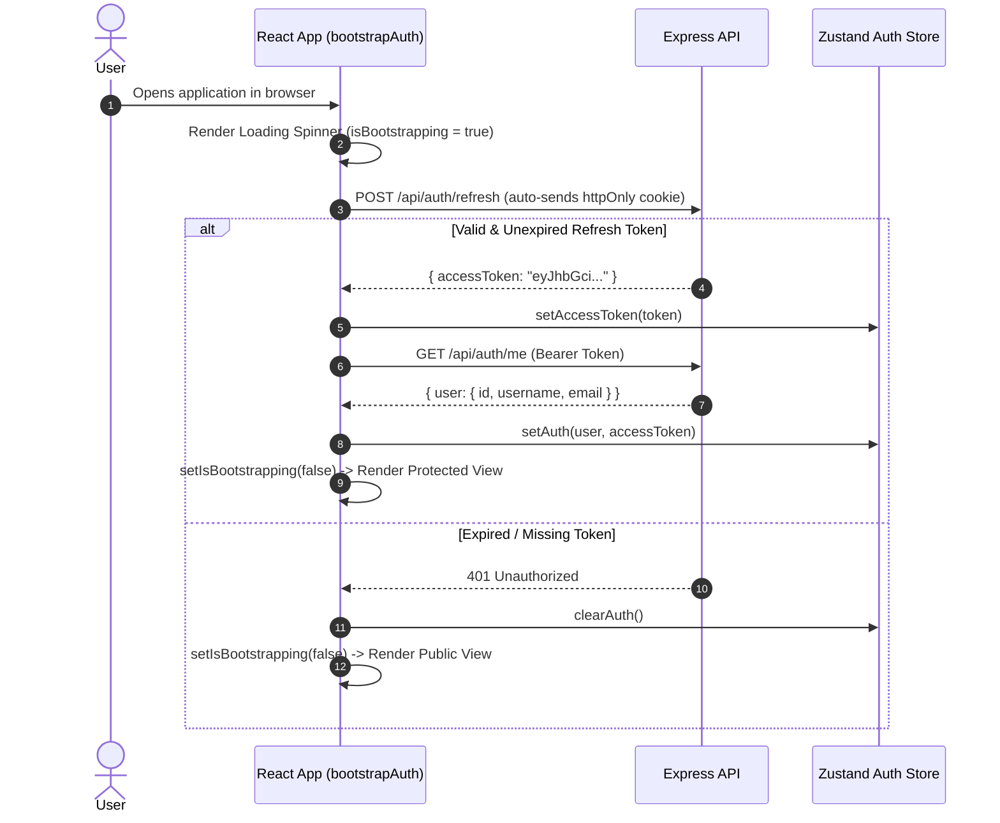
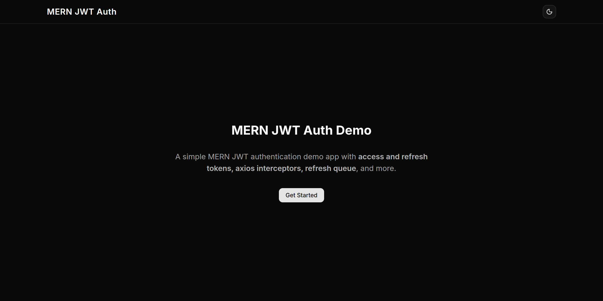
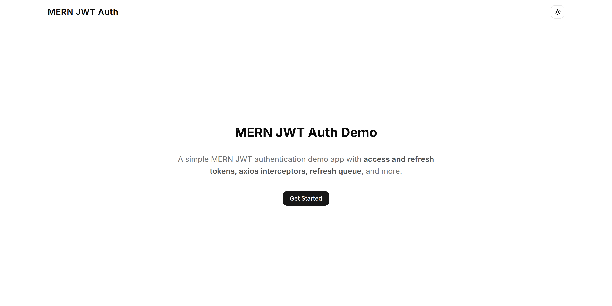
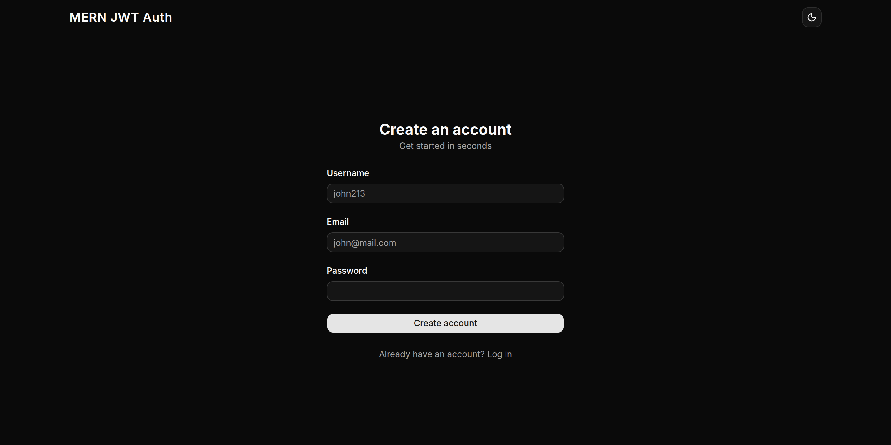
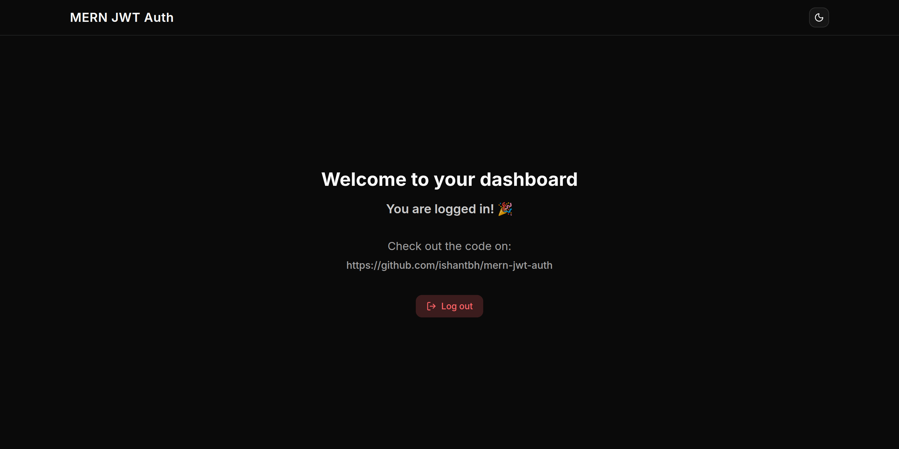
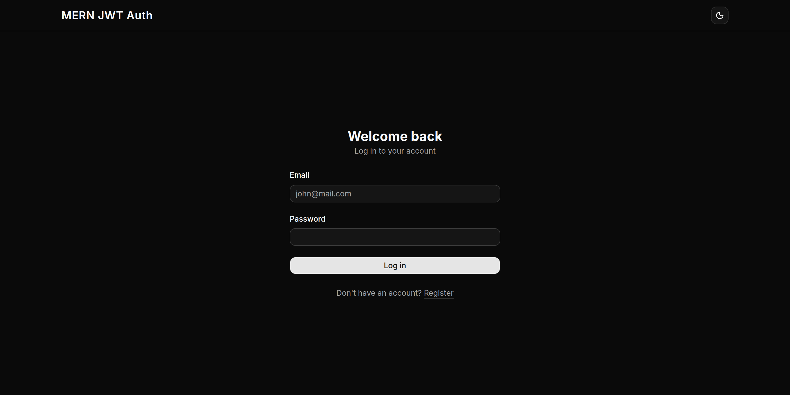

# MERN JWT Authentication System

[](https://mern-jwt-auth.up.railway.app)
[](LICENSE)
[](https://react.dev/)
[](https://www.typescriptlang.org/)
[](https://tailwindcss.com/)
[](https://expressjs.com/)
[](https://www.mongodb.com/)

> **A production-grade, secure full-stack authentication boilerplate built on the MERN stack.** Engineered with strict separation of token concerns: ephemeral in-memory access tokens, encrypted `httpOnly` refresh tokens, race-condition-resilient Axios request queuing, and instant server-side session invalidation via token versioning.

**Live Application**: [https://mern-jwt-auth.up.railway.app](https://mern-jwt-auth.up.railway.app)  
**Source Repository**: [https://github.com/ishantbh/mern-jwt-auth](https://github.com/ishantbh/mern-jwt-auth)

---

## Table of Contents

- [Overview & Problem Statement](#-overview--problem-statement)
- [Key Features & Security Highlights](#-key-features--security-highlights)
- [System Architecture & Sequence Flows](#-system-architecture--sequence-flows)
  - [High-Level Architecture](#high-level-architecture)
  - [Silent Token Refresh with Request Queuing](#silent-token-refresh-with-request-queuing)
  - [App Initialization & Hydration](#app-initialization--hydration)
- [Screenshots & UI Showcase](#-screenshots--ui-showcase)
- [Tech Stack & Engineering Rationale](#-tech-stack--engineering-rationale)
- [Security Engineering & Design Trade-offs](#-security-engineering--design-trade-offs)
- [API Reference](#-api-reference)
- [Project Directory Structure](#-project-directory-structure)
- [Local Development Guide](#-local-development-guide)
  - [Prerequisites](#prerequisites)
  - [Environment Variables](#environment-variables)
  - [Installation & Running](#installation--running)
- [Production Deployment](#-production-deployment)
- [License](#-license)

---

## Overview & Problem Statement

Most single-page web applications implement authentication unsafely by storing JSON Web Tokens (JWTs) inside browser `localStorage` or `sessionStorage`. While convenient, **any token stored in client storage is vulnerable to exfiltration via Cross-Site Scripting (XSS)**. Conversely, storing raw access tokens in cookies often exposes apps to Cross-Site Request Forgery (CSRF).

This project demonstrates a battle-tested enterprise authentication pattern solving both issues:

1. **Zero Access Tokens in Persistent Browser Storage**: The 15-minute Access Token lives solely in transient client memory via **Zustand**. When the browser tab closes, the token evaporates.
2. **HttpOnly Refresh Cookies**: The 7-day Refresh Token is isolated inside an `httpOnly`, `Secure`, `SameSite=Strict` cookie bound exclusively to the `/api/auth` path, preventing JavaScript access and minimizing CSRF attack surface.
3. **Queue-Based Concurrent Request Interceptor**: When an access token expires while multiple API requests are in flight, a custom Axios interceptor executes a single refresh call while queueing all other pending requests in memory, seamlessly replaying them once the new token arrives.
4. **Token Versioning Revocation**: Avoids maintaining a resource-intensive Redis blacklist by embedding a `tokenVersion` integer in the MongoDB user record. Incrementing this counter instantly revokes all active refresh tokens across every device.

---

## Key Features & Security Highlights

### Authentication & Authorization

- **Dual-Token Flow**: 15-minute JWT Access Tokens + 7-day Rotating Refresh Tokens.
- **Silent Refresh on Startup**: Automatic session restoration via `/api/auth/refresh` on page reload without flashing unauthenticated screens.
- **Session Revocation via `tokenVersion`**: Invalidate all sessions globally upon logout or security events without persistent token blacklists.
- **Rate-Limiting Protection**: Strict limits (10 attempts per 15-minute window per IP) applied to `/api/auth/login` and `/api/auth/register` to prevent credential stuffing and brute-force attacks.
- **Helmet Security Headers**: Automatically applies HTTP security headers (CSP, HSTS, X-Content-Type-Options, etc.).
- **Password Security**: Strong hashing with `bcryptjs` utilizing adaptive salt rounds.

### Client Experience & State Management

- **React 19 & React Compiler**: Built with the latest React release optimized with `@vitejs/plugin-react` and `babel-plugin-react-compiler` for automated memoization.
- **Zustand Store**: Lightweight, predictable state management storing credentials and user details in-memory without persistent leakage.
- **Client & Server Schema Validation**: End-to-end schema synchronization with **Zod 4** and **React Hook Form**.
- **Dark & Light Mode**: Seamless theme switching powered by `next-themes` and Tailwind CSS v4 design tokens.
- **Route Guards**: Dynamic `ProtectedRoute` (requires authentication) and `PublicOnlyRoute` (redirects logged-in users to `/dashboard`).

---

## System Architecture & Sequence Flows

### High-Level Architecture



---

### Silent Token Refresh with Request Queuing

When multiple concurrent requests encounter an expired access token (`401 Unauthorized`), the client intercepts the failure, initiates a single refresh request, buffers incoming requests into an in-memory queue, and retries all requests after token acquisition:



---

### App Initialization & Hydration

On hard refresh or initial tab load, the application silently restores the user session:



---

## Screenshots & UI Showcase

The user interface is built with **Tailwind CSS v4** and **Radix UI / Shadcn**, featuring responsive layouts, fluid typography, dark/light themes, and accessible form controls.

|              Landing Page (Dark Theme)              |                 Landing Page (Light Theme)                 |
| :-------------------------------------------------: | :--------------------------------------------------------: |
|  |  |

|                 Secure Registration                 |             Authenticated Dashboard              |
| :-------------------------------------------------: | :----------------------------------------------: |
|  |  |

|        Login with Real-Time Validation        |
| :-------------------------------------------: |
|  |

---

## Tech Stack & Engineering Rationale

| Category                  | Technology                                                                                                             | Version          | Engineering Role & Rationale                                                            |
| :------------------------ | :--------------------------------------------------------------------------------------------------------------------- | :--------------- | :-------------------------------------------------------------------------------------- |
| **Frontend Framework**    | [React](https://react.dev/)                                                                                            | `^19.2.8`        | Latest React version utilizing concurrent features and seamless state transitions.      |
| **Compiler & Build Tool** | [Vite](https://vitejs.dev/) + [React Compiler](https://react.dev/learn/react-compiler)                                 | `^8.3.0`         | Ultra-fast HMR and build speeds with automated compiler-level memoization.              |
| **Routing**               | [React Router](https://reactrouter.com/)                                                                               | `^8.4.0`         | Declarative client-side routing with specialized layout wrappers and route guards.      |
| **State Management**      | [Zustand](https://zustand.docs.pmnd.rs/)                                                                               | `^5.0.15`        | Minimal boilerplate store for keeping the ephemeral access token exclusively in memory. |
| **Styling & UI**          | [Tailwind CSS](https://tailwindcss.com/) + [Radix UI](https://www.radix-ui.com/)                                       | `v4.3.3`         | Modern CSS engine with accessible, unstyled UI primitives and dynamic theming.          |
| **Form Handling**         | [React Hook Form](https://react-hook-form.com/) + [Zod](https://zod.dev/)                                              | `^7.88` / `^4.6` | High-performance uncontrolled form handling with synchronous schema validation.         |
| **HTTP Client**           | [Axios](https://axios-http.com/)                                                                                       | `^1.20.0`        | Custom interceptor architecture with request queues for automated token refresh.        |
| **Backend Runtime**       | [Node.js](https://nodejs.org/) & [Express](https://expressjs.com/)                                                     | `^5.2.1`         | Express 5 native async route handling, modular architecture, and static SPA serving.    |
| **Language**              | [TypeScript](https://www.typescriptlang.org/)                                                                          | `^7.0.2`         | Full-stack end-to-end type safety, typed middleware, and schema inference.              |
| **Database & ODM**        | [MongoDB](https://www.mongodb.com/) + [Mongoose](https://mongoosejs.com/)                                              | `^9.10.1`        | Document storage with schema hooks (`pre-save` bcrypt hashing) and projection controls. |
| **Security & Auditing**   | [Helmet](https://helmetjs.github.io/) / [Express Rate Limit](https://github.com/express-rate-limit/express-rate-limit) | `^8.3` / `^8.7`  | HTTP header hardening, rate limiting, and brute-force mitigation.                       |
| **Logging**               | [Pino](https://getpino.com/) + [Pino-HTTP](https://github.com/pinojs/pino-http)                                        | `^10.3.1`        | Ultra-low overhead structured JSON logging for observability in production.             |

---

## Security Engineering & Design Trade-offs

### 1. In-Memory Token Storage vs. `localStorage`

| Vector                 | `localStorage`                                                          | In-Memory (Zustand) + `httpOnly` Cookie                                                  |
| :--------------------- | :---------------------------------------------------------------------- | :--------------------------------------------------------------------------------------- |
| **XSS Vulnerability**  | **High**: Any injected script can read `localStorage.getItem('token')`. | **Mitigated**: JavaScript cannot access the `httpOnly` cookie; memory space is isolated. |
| **CSRF Vulnerability** | **None** (Requires custom Authorization header).                        | **Mitigated**: `SameSite=Strict/Lax` + path scoped strictly to `/api/auth`.              |
| **Persistence**        | Persists across tab reloads automatically.                              | Restored seamlessly via silent `/api/auth/refresh` on app load.                          |

### 2. Session Invalidation via `tokenVersion`

Maintaining a centralized blacklist of revoked tokens in Redis adds operational complexity and infrastructure overhead.

Instead, this project utilizes **Token Versioning**:

1. The `User` MongoDB model contains a `tokenVersion: { type: Number, default: 0, select: false }` field.
2. The refresh token payload encodes `{ userId, tokenVersion }`.
3. When `/api/auth/refresh` is requested, the token’s version is validated against the database value.
4. On logout or password reset, MongoDB increments `tokenVersion` by `1` via `$inc`.
5. Every previously issued refresh token becomes immediately invalid without requiring a separate caching tier.

### 3. Request Queue Synchronization

If a user triggers three simultaneous dashboard API calls when their token expires, a naive client would trigger three concurrent `/api/auth/refresh` requests, causing race conditions and unnecessary database writes. The custom Axios interceptor implemented in [`client/src/api/axios-client.ts`](client/src/api/axios-client.ts) flags `isRefreshing = true` on the first 401 and parks subsequent requests in `refreshQueue`, releasing all queued requests once the primary refresh completes.

---

## API Reference

Base URL in development: `http://localhost:3000/api`  
Base URL in production: `https://mern-jwt-auth.up.railway.app/api`

### Endpoints

#### 1. Register Account

- **Endpoint**: `POST /api/auth/register`
- **Rate Limit**: 10 requests / 15 minutes
- **Request Body**:
  ```json
  {
    "username": "johndoe",
    "email": "john@example.com",
    "password": "SecurePassword123"
  }
  ```
- **Responses**:
  - `201 Created`: Sets `refreshToken` cookie and returns:
    ```json
    {
      "user": {
        "id": "66f...",
        "username": "johndoe",
        "email": "john@example.com"
      },
      "accessToken": "eyJhbGci..."
    }
    ```
  - `409 Conflict`: User or email already registered.
  - `400 Bad Request`: Validation failure.

#### 2. User Login

- **Endpoint**: `POST /api/auth/login`
- **Rate Limit**: 10 requests / 15 minutes
- **Request Body**:
  ```json
  {
    "email": "john@example.com",
    "password": "SecurePassword123"
  }
  ```
- **Responses**:
  - `200 OK`: Sets `refreshToken` cookie and returns user data + access token.
  - `401 Unauthorized`: Invalid credentials.

#### 3. Refresh Access Token

- **Endpoint**: `POST /api/auth/refresh`
- **Headers**: Cookie `refreshToken=<jwt>` (automatic in browser)
- **Responses**:
  - `200 OK`:
    ```json
    {
      "accessToken": "eyJhbGci..."
    }
    ```
  - `401 Unauthorized`: Token missing, expired, or version mismatch.

#### 4. User Logout

- **Endpoint**: `POST /api/auth/logout`
- **Description**: Increments `tokenVersion` in the database, clears the client `refreshToken` cookie.
- **Responses**:
  - `200 OK`:
    ```json
    {
      "message": "Logged out successfully"
    }
    ```

#### 5. Get Current User Profile

- **Endpoint**: `GET /api/auth/me`
- **Headers**: `Authorization: Bearer <accessToken>`
- **Responses**:
  - `200 OK`:
    ```json
    {
      "user": {
        "id": "66f...",
        "username": "johndoe",
        "email": "john@example.com"
      }
    }
    ```
  - `401 Unauthorized`: Missing or invalid Bearer token.

#### 6. Health Check

- **Endpoint**: `GET /api/health`
- **Responses**:
  - `200 OK`: `{ "status": "ok", "timestamp": "2026-09-19T17:48:00.000Z" }`

---

## Project Directory Structure

```text
mern-jwt-auth/
├── client/                     # Frontend SPA (React 19 + Vite + Tailwind v4)
│   ├── public/                 # Static web assets
│   ├── src/
│   │   ├── api/                # Axios instance & token refresh interceptor
│   │   ├── components/         # UI components, layout headers, theme toggles
│   │   │   └── ui/             # Radix & Shadcn UI building blocks
│   │   ├── contexts/           # Next-themes theme provider
│   │   ├── hooks/              # Custom React hooks (useTheme)
│   │   ├── layouts/            # Persistent root layouts
│   │   ├── lib/                # Bootstrap auth initializer & utility helpers
│   │   ├── pages/              # Home, Login, Register, Dashboard views
│   │   ├── routes/             # ProtectedRoute & PublicOnlyRoute wrappers
│   │   ├── schemas/            # Zod validation schemas for forms
│   │   ├── store/              # Zustand slices (auth-slice.ts)
│   │   ├── App.tsx             # Root routing tree
│   │   └── main.tsx            # React application entry point
│   ├── package.json
│   └── vite.config.ts
├── server/                     # Backend API (Express 5 + TypeScript + Mongoose)
│   ├── src/
│   │   ├── config/             # MongoDB connection configuration
│   │   ├── controllers/        # Auth controller (login, register, refresh, logout)
│   │   ├── middlewares/        # Error handlers, rate limiter, protect, validate
│   │   ├── models/             # Mongoose User model with bcrypt pre-hooks
│   │   ├── routes/             # Express routing definitions
│   │   ├── schemas/            # Server-side Zod request validation
│   │   ├── utils/              # JWT generator, cookie config, Pino logger
│   │   ├── app.ts              # Express application assembly & static file hosting
│   │   └── index.ts            # Server entry point and listener
│   ├── package.json
│   └── tsconfig.json
├── public/                     # Repository media & documentation assets
│   └── screenshots/            # UI screenshots referenced in README
├── package.json                # Root orchestration scripts (dev, build, start)
└── README.md                   # Project documentation
```

---

## Local Development Guide

### Prerequisites

- **Node.js**: v18+ or v20+ recommended
- **npm** or **pnpm**
- **MongoDB**: Local MongoDB instance or free [MongoDB Atlas Cluster](https://www.mongodb.com/atlas)

### Environment Variables

Create a `.env` file in the `server/` directory:

```bash
# server/.env
PORT=3000
NODE_ENV=development
CLIENT_URL=http://localhost:5173

# MongoDB Connection
MONGODB_URI=mongodb+srv://<username>:<password>@cluster.mongodb.net/mern-jwt-auth?retryWrites=true&w=majority

# JWT Secrets (generate with `openssl rand -hex 64`)
JWT_ACCESS_SECRET=your_super_secret_access_key_here
JWT_REFRESH_SECRET=your_super_secret_refresh_key_here
JWT_ACCESS_EXPIRY=15m
JWT_REFRESH_EXPIRY=7d
```

### Installation & Running

1. **Clone the repository**:

   ```bash
   git clone https://github.com/ishantbh/mern-jwt-auth.git
   cd mern-jwt-auth
   ```

2. **Install all dependencies** (or use the root install script):

   ```bash
   cd client && npm install
   cd ../server && npm install
   cd ..
   ```

3. **Start Development Servers concurrently**:

   In Terminal 1 (Start the Express API server with TSX hot reload):

   ```bash
   npm run dev:server
   # Server runs at http://localhost:3000
   ```

   In Terminal 2 (Start the Vite dev server):

   ```bash
   npm run dev:client
   # Client runs at http://localhost:5173
   ```

4. Open your browser and navigate to `http://localhost:5173`.

---

## Production Deployment

The project is architected for unified single-service hosting platforms like **Railway**, **Render**, or **Heroku**:

1. **Root Build Pipeline**:
   The root `package.json` includes an automated build step:
   ```json
   "scripts": {
     "build": "npm install --prefix client && npm run build --prefix client && npm install --prefix server && npm run build --prefix server",
     "start": "npm run start --prefix server"
   }
   ```
2. **Static Asset Delivery**:
   In production (`NODE_ENV=production`), Express statically serves the optimized React SPA bundle from `client/dist` and provides a fallback wildcard route (`/^(?!\/api).*/`) directing navigation back to `index.html` for client-side routing.
3. **Railway Deployment**:
   - Create a new project on [Railway](https://railway.app/).
   - Connect the GitHub repository.
   - Configure the environment variables (`MONGODB_URI`, `JWT_ACCESS_SECRET`, `JWT_REFRESH_SECRET`, `NODE_ENV=production`).
   - Railway triggers `npm run build` and boots the application with `npm run start`.

---

## License

This project is open source and available under the [MIT License](LICENSE).
